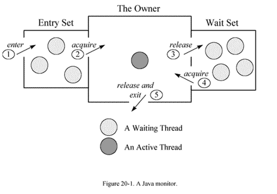



## jstat
**用处:** 实时统计GC的时间，次数等，帮助识别应用是否存在频繁创建对象，但是未及时释放，导致频繁的GC。
    
	jstat -help
	jstat -options
	jstat -snap <pid>
	jstat -<option> [-t] [-h<lines>] <pid> [<mill second> [<count>]]

## jmap
**用处:** 用于dump堆内存进行分析，或者dump出堆内存中的对象明细，分析目前堆中对象占用的情况

	jmap -help
	jmap -dump
	jmap -histo

## top
**用处:** 实时显示linux中处理器的使用情况，内核管理的任务，及CPU，内存的使用率
http://www.jb51.net/LINUXjishu/34604.html

经常会用到的10进制转成16进制：

	 echo 'ibase=10;obase=16;3845' | bc

## jstack
打印进程当前时刻的线程栈，可以分析是否发生了死锁，当前所有线程空忙情况，忙于做什么任务，同时可以定位消耗CPU的线程此时此刻的任务情况

[死锁例子及死锁线程栈的Log](https://github.com/jimmysc/jimmysc.github.com/tree/master/jimmysc-thread/src/main/java/com/jimmysc/thread/deadlock)

	
	1.运行ThreadDeadLockTest
	2.JPS
	3.jstack -l <pid>

线程内容

	"Thread-0" prio=5 tid=0x00007f94f3832000 nid=0x5003 waiting for monitor entry [0x000000011972f000]
	java.lang.Thread.State: BLOCKED (on object monitor)
	at com.jimmysc.thread.deadlock.Thread1.run(Thread1.java:19)
	- waiting to lock <0x00000007d57a7008> (a java.lang.Class for com.jimmysc.thread.deadlock.ThreadLock2)
	- locked <0x00000007d5655148> (a java.lang.Class for com.jimmysc.thread.deadlock.ThreadLock1)
	at java.lang.Thread.run(Thread.java:744)
	
	Locked ownable synchronizers:
	- None
	线程有3部分信息
	1.线程的状态：waiting for monitor entry
	2.线程的调用栈：
	3.线程当前锁住的资源：locked <0x00000007d5655148> (a java.lang.Class for com.jimmysc.thread.deadlock.ThreadLock1)

线程状态
	
	1.runnable
		表示线程具备运行条件等待操作系统调度，或正在运行中
	2.waiting on condition
		表示线程等待某个条件的发生：比如sleep、网络空闲等
	3.Waiting for monitor entry 和 in Object.wait() 
		Monitor是java中实现线程之间互斥和协作的主要手段，它可以看成是对象或class的锁，每个对象都有，但只有一个Monitor，下图描述Monitor，线程及线程状态的转换图
	
		

jstack分析 http://www.blogjava.net/jzone/articles/303979.html

线程解释 http://blog.csdn.net/a43350860/article/details/8134234

## tsar

http://tsar.taobao.org/
